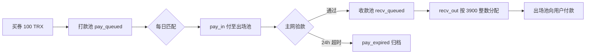

# 无服务器排单算法 · pool-v4-dual-pool（中文版）

> **规则版本**：`pool-v4-dual-pool`  
> **参考实现**：[`shared/pool-rules.js`](../shared/pool-rules.js)、[`shared/pool-config.js`](../shared/pool-config.js)、[`shared/exit-pay-verify.js`](../shared/exit-pay-verify.js)  
> **英文版**：[pool-v4-algorithm-en.md](./pool-v4-algorithm-en.md)

---

## 1. 设计目标

本算法用于 **方案 A：无后端排单**。任意参与者仅凭公开规则与链上数据，即可独立复现相同的排队、匹配与验款结果。

| 原则 | 说明 |
|------|------|
| 公开可验证 | 规则与引擎源码可发布在 GitHub，人人可回放 |
| 链上为真 | 买券、出场打款均以 TronGrid 主网交易为准 |
| 无用户自报 | 不使用测试网 anchor，「我已打款」= 刷新 TronGrid |
| 双池分离 | **打款池**与**收款池**职责分离，买券 ≠ 成为收款人 |
| 可增量回放 | 已完成/超时/屏蔽订单归档为快照，避免全历史重算 |

---

## 2. 核心概念

### 2.1 双池模型



- **打款池（Pay Pool）**：用户买券后进入，等待被选中承担「溢出额度」的出场打款义务。
- **出场池（Exit Pool）**：固定主网收款地址，承接打款池汇出的 TRX；验款通过后，对应用户进入收款池。
- **收款池（Receive Pool）**：验款通过者排队，按 **3900 TRX 整数**（以档位 `exitAmountTrx` 为准）获得出场收款资格。

### 2.2 买券 ≠ 收款人

向 `purchaseAddress` 支付 `ticketPriceTrx`（如 100 TRX）仅获得 `poolCreditTrx`（如 3000）的池内额度，**不会**自动成为当日收款人。必须先完成出场池打款并经主网验款，才进入收款池。

### 2.3 出场池地址

三档默认共用主网出场池：

```
TRjvctzrc5WcEeu2UrT8mV5H6zW8dCgimR
```

可通过环境变量 `POOL_EXIT_ADDRESS` 或分档 `POOL_EXIT_3000` 等覆盖。

---

## 3. 档位配置（以 3000 档为例）

| 字段 | 值 | 含义 |
|------|-----|------|
| `ticketPriceTrx` | 100 | 买券实付 TRX |
| `poolCreditTrx` | 3,000 | 计入资金池额度 |
| `poolTargetTrx` | 300,000 | 池满阈值 |
| `exitAmountTrx` | 3,900 | 单次出场应收 TRX |
| `purchaseAddress` | 链上配置 | 买券收款地址 |
| `exitPoolAddress` | 见上 | 出场应付地址 |

30000 档、30 万档按相同比例放大，详见 `pool-config.js` 中 `POOL_PURCHASE_CONFIG`。

---

## 4. 全局常量

| 常量 | 值 | 说明 |
|------|-----|------|
| `ENTRY_PERIOD_DAYS` | 15 | 首笔有效买券后须满 15 天才可匹配 |
| `MATCH_PAYMENT_TIMEOUT_HOURS` | 24 | pay_in 打款截止时间 |
| `MAX_OPEN_ENTRIES_PER_PAYER` | 1 | 同一付款地址同时仅 1 笔开放订单 |
| `DAILY_MATCH_UTC_HOUR` | 0 | 每日 UTC 0:00 匹配（北京 08:00） |
| `MATCHES_PER_DAY` | 1 | 每日仅匹配一次 |

---

## 5. 订单状态机

| 状态 | 池 | 含义 |
|------|-----|------|
| `pay_queued` | 打款池 | 买券成功，排队等待被选为付款方 |
| `pay_pending` | 打款池 | 已生成 pay_in 任务，待付至出场池 |
| `pay_expired` | 归档 | 出场打款超时，不再参与匹配 |
| `recv_queued` | 收款池 | 主网验款通过，等待 recv_out 分配 |
| `recv_partial` | 收款池 | 零头未凑满 exitAmount，次日继续 |
| `recv_pending` | 收款池 | 已分配完整出场额度，等待链上收款 |
| `done` | 归档 | 出场完成 |
| `blocked` | 归档 | 违反「一人一单」等规则被屏蔽 |
| `consumed` | 归档 | 额度已消耗 |

**冻结状态**（生命周期不再回退）：`pay_pending`、`pay_expired`、`recv_*`、`done`、`consumed`、`blocked`。

---

## 6. 输入数据

回放引擎 `runPoolCycle` 需要：

1. **`purchaseTxs`**：打入 `purchaseAddress`、金额等于 `ticketPriceTrx` 的买券交易列表。
2. **`exitPoolTxs`**：打入 `exitPoolAddress`、金额 **不等于** 买券价的出场池入账交易。
3. **`snapshot`**（可选）：上次检查点快照，用于增量回放。
4. **`nowMs`**：当前评估时刻（墙钟时间，用于验款窗口与超时）。

交易排序规则（确定性）：

```
blockNumber ↑ → blockTimestamp ↑ → txHash 字典序 ↑
```

地址比较须支持 Base58（`T…`）与 hex（`41…`）归一化。

---

## 7. 账本与匹配条件

### 7.1 池内额度账本

```
ledgerBalance = Σ(非 blocked/pay_expired/done 的 poolCreditTrx) − Σ(历史 matchedCreditTrx)
```

### 7.2 可否今日匹配（`canMatch`）

须 **同时** 满足：

1. `ledgerBalance >= poolTargetTrx`（池满）
2. 距首笔有效订单已满 `ENTRY_PERIOD_DAYS` 天
3. `overflow = ledgerBalance − poolTargetTrx > 0`（有溢出才可匹配）

仅匹配 **溢出部分**，池内 30 万（目标额）本身不被「消耗掉」。

---

## 8. 每日匹配算法（UTC 0:00）

每个匹配日 `dayStartMs` 按序执行：

### 步骤 1 — 合并买券

- 全量回放：纳入 `blockTimestamp <= dayStartMs` 的全部买券。
- 增量回放：仅纳入 `snapshotAtMs < blockTimestamp <= dayStartMs` 的新买券。

### 步骤 2 — 生命周期（一人一单）

同一 `payer` 若已有开放订单，后续买券标记为 `blocked`，原因：`一次只能排一单`。

### 步骤 3 — 主网验款

对状态为 `pay_pending` 的订单，用 `exitPoolTxs` 在 `[matchAtMs, evaluationMs]` 窗口内验款：

- 全部 pay_in 任务命中 → `recv_queued`，记录 `verifiedMainnetTxId`
- 超过 `deadlineMs` 仍未付清 → `pay_expired`

验款规则见第 9 节。

### 步骤 4 — 若 `canMatch`，生成匹配

#### 8.1 选取打款方（从打款池队尾向前）

从 `pay_queued` **队尾**向前累加 `remainingPoolCreditTrx`，直到总和 ≥ `overflow`。

被选中的付款方生成 **pay_in** 任务：

```
assignmentId = pay_{matchDayId}_{entryId}
channel      = pay_in
amountTrx    = 该付款方可用额度
collector    = exitPoolAddress
deadlineMs   = matchAtMs + 24h
```

对应 entry → `pay_pending`。

#### 8.2 收款池分配（recv_out）

溢出额度 `overflow` 先满足 `recv_partial` _carryover_（零头补满），再按 `exitAmountTrx` 整数分配给 `recv_queued` 队首：

| 情况 | 处理 |
|------|------|
| 完整 3900 名额 | `recv_pending` |
| 不足 3900 的零头给下一位 | `recv_partial`，记录 `exitRemainderTrx` |
| 零头无法排给任何人 | 打回 `purchaseAddress`（ticket_surplus） |

#### 8.3 记账

```
matchedCreditTrx = Σ(pay_in.amountTrx) + Σ(ticket_surplus.amountTrx)
```

写入当日 `matchDays` 摘要，供后续日期的账本扣减。

---

## 9. 出场池主网验款

函数：`derivePayVerifications(payAssignments, exitPoolTxs, exitPoolAddress, evaluationMs)`

对同一 `payerEntryId` 的全部 pay_in 任务：

| 条件 | 要求 |
|------|------|
| 付款地址 | `fromAddress` = 任务 `payer` |
| 收款地址 | `toAddress` = `exitPoolAddress`（若链上带 to） |
| 金额 | 与 `amountTrx` 一致（4 位小数） |
| 时间 | `matchAtMs <= blockTimestamp <= evaluationMs` |
| 去重 | 每笔链上 tx 全局仅用一次 |

全部任务命中 → 验款通过；任一时间超过 `deadlineMs` 且未付清 → `pay_expired`。

**不使用**测试网、用户手动提交的 tx 哈希或 WSS 推送作为验款依据。

---

## 10. 检查点快照（增量回放）

归档状态：`done`、`pay_expired`、`blocked` 不进入 `activeEntries`，仅保留 `blockedPayers` 名单。

快照字段：

- `rulesVersion`、`poolId`、`snapshotAtMs`
- `activeEntries`、`matchDays`
- `blockedPayers`、`usedExitTxIds`、`lastQueueIndex`

增量回放时：

- 仅从 `snapshotAtMs` 之后拉新买券
- 匹配循环从 `lastMatchDayMs + 1天` 继续
- 复杂度 ≈ O(新增天数 + 新订单)，而非 O(全历史)

---

## 11. API 入口

```javascript
const { runPoolCycle, runAllPools } = require('./shared/pool-rules');

const result = runPoolCycle({
  poolId: '3000',
  purchaseTxs,      // 买券 tx
  exitPoolTxs,      // 出场池 tx
  snapshot,         // 可选
  nowMs: Date.now(),
});
```

返回（节选）：

| 字段 | 含义 |
|------|------|
| `entries` | 当前全部有效订单 |
| `fill` | 池满度、溢出、canMatch |
| `payAssignments` | 当日 pay_in 任务 |
| `recvAssignments` | 当日 recv_out 任务 |
| `exitPoolAddress` | 出场池地址 |
| `snapshot` | 新检查点（客户端本地持久化） |
| `replayMode` | `full` 或 `incremental` |

---

## 12. 确定性保证

任意两方若满足：

1. 使用相同 `rulesVersion`
2. 拉取相同买券 + 出场池交易集（含分页完整性与地址归一化）
3. 使用相同 `nowMs` 与相同起始 `snapshot`

则 `entries`、`payAssignments`、`recvAssignments` 结果 **完全一致**。这也是算法可公开在 GitHub 的前提。

---

## 13. 参考测试

| 测试文件 | 覆盖场景 |
|----------|----------|
| `test-dual-pool-bootstrap.js` | 双池基础回放 |
| `test-pay-verify.js` | 出场池验款 |
| `test-pay-expired.js` | 打款超时 |
| `test-snapshot-incremental.js` | 同日增量快照 |
| `test-snapshot-next-day.js` | 跨日增量快照 |

运行：

```bash
node shared/test-dual-pool-bootstrap.js
node shared/test-pay-verify.js
node shared/test-pay-expired.js
node shared/test-snapshot-incremental.js
node shared/test-snapshot-next-day.js
```

---

## 14. 客户端对齐

Flutter 客户端 [`Client-flutter`](https://github.com/yongchaoqiu111/Client-flutter) 中：

- `lib/services/pool_engine_service.dart` — Dart 引擎，与本规则对齐
- `lib/services/pool_matcher_service.dart` — TronGrid 拉取 + 本地回放
- `lib/services/pool_snapshot_store.dart` — 快照本地持久化

规则版本字符串须与 `POOL_RULES_VERSION` 一致，否则应丢弃旧快照做全量回放。

---

*文档随 `pool-v4-dual-pool` 规则维护。如有歧义，以 `shared/pool-rules.js` 源码为准。*
